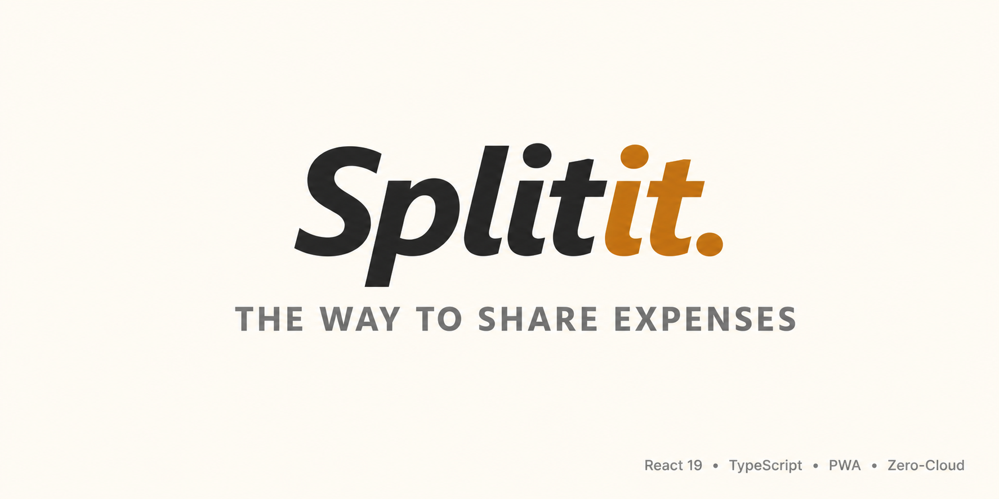
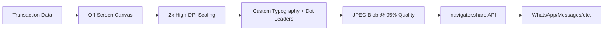
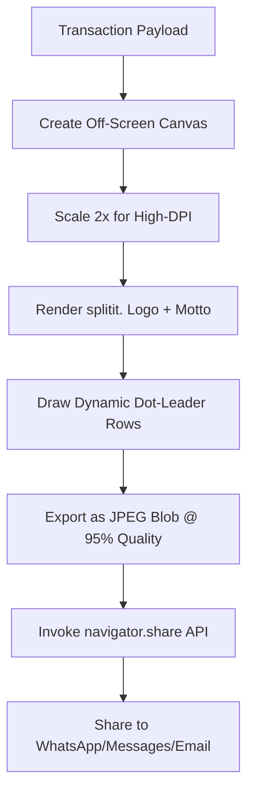

<div align="center">
  
</div>

<br />

<p align="center">
  <strong>Zero-cloud. Privacy-first. Beautifully simple expense sharing.</strong>
</p>

<p align="center">
  <a href="https://opensource.org/licenses/MIT">
    
  </a>
  <a href="https://react.dev">
    
  </a>
  <a href="https://www.typescriptlang.org">
    
  </a>
  <a href="https://vitejs.dev">
    
  </a>
  <a href="https://tailwindcss.com">
    
  </a>
  <a href="https://web.dev/progressive-web-apps/">
    
  </a>
</p>

<br />
## 🚀 Live Demo

<div align="center">
  
  [](https://splitit-app-nu.vercel.app/)
  
  <br />
  <sub><strong>Zero-Cloud • Privacy-First • Instant Share</strong></sub>
  
  <br /><br />
  
  > 💡 **Pro Tip:** Open on mobile and tap **"Add to Home Screen"** to install as a native-like PWA. No app store download required!

</div>

<br />

<div align="center">
  <!-- Optional: Add a screenshot of your app here if you have one -->
  <!--  -->
</div>

---

## 🌿 Philosophy

Modern financial utilities have become bloated with intrusive tracking, mandatory cloud accounts, and micro-transactions. **Splitit.** was designed to counter this.

> ✨ A utility built for close companions, couples, and roommates who want to calculate and balance peer expenses instantly on a shared phone screen — **without compromising their personal data.**

🔐 **All financial state, participant configurations, and local histories remain strictly within your physical device.**  
→ No database servers queried  
→ No accounts registered  
→ No tracking scripts injected

---

## ✨ Key Features

### 🔒 Zero-Cloud Privacy (100% On-Device)
```diff
+ No databases
+ No cloud authentication
+ Zero external network calls
+ All data stored in device localStorage via Zustand reactive store
```

### 🎨 Boutique "Natural Tones" Visual Aesthetic
A premium interface designed to feel natural and low-fatigue:
- 🟢 Rich earthy olives for primary actions
- 🟤 Warm cream boards for content surfaces  
- ⚪ Soft contrasting text layers for readability
- 🌓 Seamless dark mode following OS preferences

### 📊 Programmatic Off-Screen Canvas Receipts
Create stunning, high-fidelity receipt cards entirely client-side:


### 🔢 Float-Proof Integer-Safe Split Math
JavaScript's floating-point quirks? Not here. All monetary values are normalized to **integer cents** before any calculation:
```typescript
// Input: $12.50 → Internal: 1250 (cents) → Output: $12.50
const normalize = (decimal: number): number => Math.round(decimal * 100);
const display = (cents: number): string => (cents / 100).toFixed(2);
```

### 📱 Integrated Mobile Web Hardware Bridges
| Feature | API | Benefit |
|---------|-----|---------|
| 📇 Contact Picker | `navigator.contacts` | Import roommates instantly from phone contacts |
| 🔐 Biometric Vault | WebAuthn + PIN | Shield financial details even on unlocked devices |
| 📤 Native Share | `navigator.share` | Dispatch receipt images directly to messaging apps |

---

## 🎨 Design System & Tokens

Built with CSS custom properties + Tailwind CSS configuration:

| Token | Light Mode | Dark Mode | Semantic Usage |
|-------|-----------|-----------|---------------|
| `--app-bg` | `#FAF8F5` | `#141413` | Main viewport background |
| `--app-card` | `#FFFFFF` | `#1C1C1A` | Card containers, input blocks |
| `--app-panel` | `#EFECE3` | `#282825` | Interactive states, tabs, buttons |
| `--app-primary` | `#4A5D4E` | `#829986` | Brand accents, headers, primary CTAs |
| `--app-accent` | `#BC6C25` | `#DDA15E` | Debt warnings, secondary actions, dot accents |
| `--app-text` | `#2C2B29` | `#FAF8F5` | Titles, bold text, high-contrast content |
| `--app-muted` | `#73706B` | `#A3A196` | Subtitles, help text, micro-copy |

> 💡 All tokens automatically adapt to `prefers-color-scheme: dark` for seamless theme transitions.

---

## 🔢 Mathematical Formulation

### 1. Currency & Value Normalization
Let $D \in \mathbb{R}$ represent human-readable decimal price (e.g., $12.50$). Map to minor integer units $V \in \mathbb{Z}$:

$$V = \text{round}(D \times 10^2)$$

After calculations, reformat for UI display:

$$\text{Display} = \frac{V}{10^2}$$

### 2. Balance Consolidation Math
For group with roommates $R = \{r_1, r_2, \dots, r_n\}$ and expenses $E$, balance $B_k$ for roommate $r_k$:

$$B_k = P_k - O_k + S_k$$

Where:
- $P_k$ = Total paid by $r_k$:
  $$P_k = \sum_{e \in E, \text{paidBy}(e) = r_k} V_e$$

- $O_k$ = Total owed by $r_k$ (equal split among participants $P_e$):
  $$O_k = \sum_{e \in E, r_k \in P_e} \text{round}\left(\frac{V_e}{|P_e|}\right)$$

- $S_k$ = Settlement history corrections:
  $$S_k = \sum_{s \in \text{Settlements}, \text{to}(s) = r_k} V_s - \sum_{s \in \text{Settlements}, \text{from}(s) = r_k} V_s$$

### 3. Simplified Debt Consolidation (Greedy Algorithm)
Resolve balances with minimum transactions:

```typescript
interface Balance { person: string; amount: number } // positive = owed, negative = owes

function settle(balances: Balance[]): Settlement[] {
  const creditors = balances.filter(b => b.amount > 0).sort((a,b) => b.amount - a.amount);
  const debtors = balances.filter(b => b.amount < 0).sort((a,b) => a.amount - b.amount);
  const settlements: Settlement[] = [];

  while (creditors[0]?.amount > 0 && debtors[0]?.amount < 0) {
    const c = creditors[0], d = debtors[0];
    const T = Math.min(c.amount, Math.abs(d.amount));
    
    settlements.push({ from: d.person, to: c.person, amount: T });
    
    c.amount -= T;
    d.amount += T;
    
    // Re-sort if needed
    creditors.sort((a,b) => b.amount - a.amount);
    debtors.sort((a,b) => a.amount - b.amount);
  }
  return settlements;
}
```

---

## 🛠️ Technical Architecture

### Directory Structure
```
splitit/
├── .gitignore
├── index.html                  # Main viewport shell
├── package.json                # Dependencies & scripts
├── tsconfig.json               # TypeScript configuration
├── vite.config.ts              # Vite + PWA manifest config
└── src/
    ├── App.tsx                 # Core router & workspace controller
    ├── index.css               # Tailwind imports + CSS tokens
    ├── main.tsx                # React 19 entry point
    ├── vite-env.d.ts           # Global TS environment types
    ├── components/             # Reusable UI components
    │   ├── ExpenseCard.tsx
    │   ├── IndividualBalance.tsx
    │   ├── SettleUpModal.tsx
    │   └── SettlementHistory.tsx
    ├── lib/
    │   └── currency.ts         # Currency formatting utilities
    ├── models/
    │   └── types.ts            # TypeScript interfaces & schemas
    ├── screens/                # Full-viewport view states
    │   ├── AddExpenseScreen.tsx
    │   ├── ExpenseListScreen.tsx
    │   ├── GroupsScreen.tsx
    │   ├── HomeScreen.tsx
    │   ├── LockScreen.tsx
    │   ├── OnboardingScreen.tsx
    │   ├── RoommatesScreen.tsx
    │   ├── SettingsScreen.tsx
    │   └── SplitScreen.tsx
    └── services/
        └── storage.ts          # localStorage adapter with Zustand sync
```

### Off-Screen Canvas Receipt Pipeline


---

## 🚀 Local Development

### Prerequisites
- Node.js ≥ 18.x
- npm or yarn

### Quick Start
```bash
# 1. Clone the repository
git clone https://github.com/mohd-ali10/splitit-app.git
cd splitit-app

# 2. Install dependencies
npm install

# 3. Start development server
npm run dev

# 4. Open in browser
# → http://localhost:5173
```

### Available Scripts
| Command | Description |
|---------|-------------|
| `npm run dev` | Start Vite dev server with HMR |
| `npm run build` | Build production assets to `/dist` |
| `npm run preview` | Preview production build locally |
| `npm run lint` | Run ESLint + TypeScript checks |
| `npm run typecheck` | Run TypeScript compiler only |

---

## 🚀 Deployment Blueprints

### Option 1: Vercel ⭐ (Recommended)
Zero-config deployment with automatic HTTPS (required for mobile APIs):

1. Sign up at [vercel.com](https://vercel.com) (free Hobby tier)
2. Connect GitHub & import `splitit-app` repository
3. Vercel auto-detects Vite config → `/dist` output
4. Click **Deploy** → Get instant HTTPS URL ✨

> 🔐 HTTPS is mandatory for `navigator.contacts` and `navigator.share` to function on mobile browsers.

### Option 2: GitHub Pages
Free hosting directly from your repository:

```bash
# 1. Install deployment helper
npm install --save-dev gh-pages

# 2. Update vite.config.ts with your repo name:
export default defineConfig({
  base: '/splitit-app/', // ← Match your GitHub repo name
  // ... rest of config
})

# 3. Add scripts to package.json:
"scripts": {
  "predeploy": "npm run build",
  "deploy": "gh-pages -d dist"
}

# 4. Deploy!
npm run deploy
```

Visit: `https://yourusername.github.io/splitit-app/`

### Option 3: Any Static Host
Since Splitit. is 100% static:
```bash
npm run build
# Upload /dist folder to:
# • Netlify Drop
# • Cloudflare Pages  
# • Firebase Hosting
# • Your own web server
```

---

## 📱 Progressive Web App (PWA) Features

Splitit. is installable and works offline:

✅ Add to Home Screen prompt  
✅ Offline-first with localStorage persistence  
✅ Splash screen & app icon support  
✅ Standalone window mode (no browser UI)  

*Configure PWA settings in `vite.config.ts` via `vite-plugin-pwa`.*

---

## 🔐 Security & Privacy Commitment

```yaml
Data Collection: NONE
Analytics: NONE
Third-party Scripts: NONE
Cloud Sync: NONE
Account System: NONE
Tracking Cookies: NONE
```

> 🛡️ Your financial data never leaves your device. Ever.

---

## 🤝 Contributing

We welcome thoughtful contributions! Please:

1. Fork the repository
2. Create a feature branch: `git checkout -b feat/amazing-idea`
3. Commit changes: `git commit -m 'feat: add amazing idea'`
4. Push to branch: `git push origin feat/amazing-idea`
5. Open a Pull Request with clear description

### Development Guidelines
- Follow existing TypeScript strict mode
- Maintain zero external API dependencies
- Preserve the natural tones design aesthetic
- Test on mobile viewports (320px–430px width)

---

## 📄 License

Distributed under the **MIT License**. See [`LICENSE`](LICENSE) for more information.

```
MIT License

Copyright (c) 2024 splitit. contributors

Permission is hereby granted, free of charge, to any person obtaining a copy
of this software and associated documentation files (the "Software"), to deal
in the Software without restriction, including without limitation the rights
to use, copy, modify, merge, publish, distribute, sublicense, and/or sell
copies of the Software, and to permit persons to whom the Software is
furnished to do so, subject to the following conditions:

The above copyright notice and this permission notice shall be included in all
copies or substantial portions of the Software.

THE SOFTWARE IS PROVIDED "AS IS", WITHOUT WARRANTY OF ANY KIND, EXPRESS OR
IMPLIED, INCLUDING BUT NOT LIMITED TO THE WARRANTIES OF MERCHANTABILITY,
FITNESS FOR A PARTICULAR PURPOSE AND NONINFRINGEMENT. IN NO EVENT SHALL THE
AUTHORS OR COPYRIGHT HOLDERS BE LIABLE FOR ANY CLAIM, DAMAGES OR OTHER
LIABILITY, WHETHER IN AN ACTION OF CONTRACT, TORT OR OTHERWISE, ARISING FROM,
OUT OF OR IN CONNECTION WITH THE SOFTWARE OR THE USE OR OTHER DEALINGS IN THE
SOFTWARE.
```

---

## 💬 Support & Community

- 🐛 Report bugs: [GitHub Issues](https://github.com/mohd-ali10/splitit-app/issues)
- 💡 Feature requests: [GitHub Discussions](https://github.com/mohd-ali10/splitit-app/discussions)
- 📧 General inquiries: Open a discussion thread

> 🌱 *Built with care, privacy, and a commitment to keeping finance human.*

---

<p align="center">
  <sub>Made with 🫶 for roommates, couples, and friends who value privacy.</sub><br>
  <strong>Splitit.</strong> — <em>The way to share expenses.</em>
</p>
